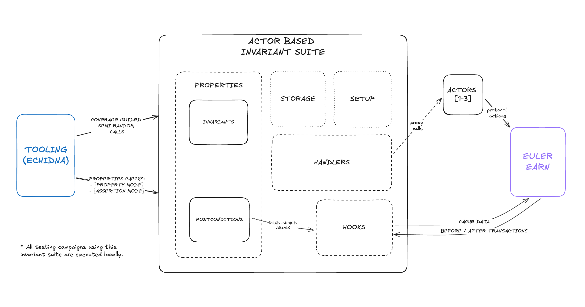

# Euler Earn

<!-- TOC FOLLOWS -->
<!-- START OF TOC -->
<!-- DO NOT EDIT! Auto-generated by md-toc: https://github.com/hoytech/md-toc -->

* [Introduction ](#introduction-)
* [Local Development](#local-development)
    * [Build](#build)
    * [Test](#test)
    * [Enigma Dark Invariants](#enigma-dark-invariants)
    * [Format](#format)
* [Smart Contracts Documentation](#smart-contracts-documentation)
* [Scripts](#scripts)
* [Security](#security)
* [Known limitations](#known-limitations)
* [License](#license)

<!-- END OF TOC -->

## Introduction 

Euler Earn is an open source protocol for permissionless risk curation on top of [ERC4626 vaults](https://eips.ethereum.org/EIPS/eip-4626)(strategies). Although it is initially designed to be integrated with [Euler V2 vaults](https://github.com/euler-xyz/euler-vault-kit), technically it supports any other vault as long as it is ERC4626 compliant.

The Euler Earn in itself is an ERC4626 vault, and any risk curator can deploy one through the factory. Each vault has one loan asset and can allocate deposits to multiple strategies. Euler Earn vaults are noncustodial and immutable instances, and offer users an easy way to provide liquidity and passively earn yield. 

For more details, please refer to the [whitepaper](/docs/whitepaper.md) and the [low-level spec](/docs/low-level-spec.md).

## Local Development


Euler Earn comes with a comprehensive set of tests written in Solidity, which can be executed using Foundry.

To install Foundry:

```sh
curl -L https://foundry.paradigm.xyz | bash
```

This will download foundryup. To start Foundry, run:

```sh
foundryup
```

To clone the repo:

```sh
git clone https://github.com/euler-xyz/euler-earn
```

### Build

```sh
forge build
```

### Test
To run the unit-tests and the e2e test:
```sh
FOUNDRY_PROFILE=test forge test
```

To run the fuzz tests:
```sh
FOUNDRY_PROFILE=fuzz forge test
```

To run the invariants tests:
```sh
FOUNDRY_PROFILE=invariant forge test
```

To run foundry coverage:
```sh
FOUNDRY_PROFILE=coverage forge coverage --report summary
```

To run echidna based fuzzing:
```sh
echidna test/echidna/CryticERC4626TestsHarness.t.sol --contract CryticERC4626TestsHarness --config test/echidna/config/echidna.config.yaml
```

To run symbolic tests using [`Halmos`](https://github.com/a16z/halmos):
```sh
halmos --match-contract EulerEarnSymbolicTest --storage-layout=generic --test-parallel --solver-parallel --solver-timeout-assertion 0
```

### Enigma Dark Invariants



To know more about the invariants suite overview and architecture, please read the Enigma [overview](./test/enigma-dark-invariants/docs/overview.md) and [internal](./test/enigma-dark-invariants/docs/internal-docs.md) docs. 

To run echidna property mode:
```sh
make echidna
```

To run echidna assertion mode:
```sh
make echidna-assert
```

To run medusa:
```sh
make medusa
```

### Format

```sh
forge fmt
```

## Smart Contracts Documentation

```sh
forge doc --serve --port 4000
```

## Scripts

You can find `foundry scripts` inside the `/script` dir to interact with Euler Earn protocol. For more details, please check the [scripts usage document](/script/README.md).

## Security

This software is **experimental** and is provided "as is" and "as available".

**No warranties are provided** and **no liability will be accepted for any loss** incurred through the use of this codebase.

Always include thorough tests when using Euler Earn protocol to ensure it interacts correctly with your code.

All audits are stored in the [audits' directory](/audits/).

## Known limitations

Refer to [this doc](/docs/known-limitations.md) for a list of known limitations and security considerations.

## License

Licensed under the [Business Source License 1.1](./LICENSE).
